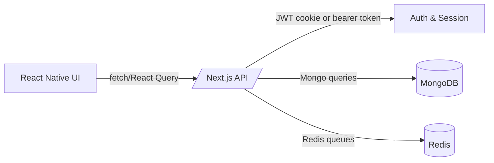

# Crypto Mine Mobile Architecture

## Overview

The React Native application mirrors the authenticated experience that ships with the web dashboard. Data is fetched from the same Next.js API using the `ApiClient` wrapper, with the `Authorization` header hydrated from the persisted session token.



## Folders

- `src/api` – REST client and hooks that communicate with the Next.js API.
- `src/features` – Feature based modules (dashboard, withdrawals, auth, settings).
- `src/navigation` – Navigation container and tab navigator wiring.
- `src/providers` – React Query provider with app-state focus integration.
- `src/store` – Zustand session store shared across the app.

## Real-time refresh

React Query polls key endpoints every `REALTIME_REFETCH_INTERVAL_MS` (default 15 seconds) and revalidates when the app returns to the foreground. This mirrors the polling strategy implemented by the website via SWR.

## Android build

Release builds use the modern React Native Gradle plugin (`com.facebook.react`). Signing details are injected via `RELEASE_*` Gradle properties so CI can supply keystores without checking them into Git.

To assemble an APK run:

```bash
cd mobile
npm install
cd android
./gradlew assembleRelease
```

The resulting artifact is generated at `mobile/android/app/build/outputs/apk/release/app-release.apk` and should be uploaded to the CDN/S3 bucket referenced by the `MOBILE_APK_DOWNLOAD_URL` environment variable on the web tier.
